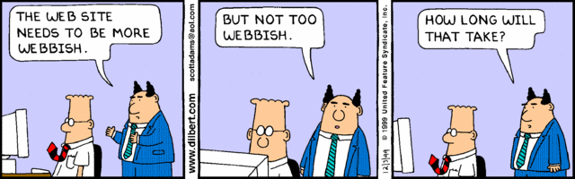

#   SOFTWARE ENGINEERING IMMERSIVE

# Project 1

## Task

Your task is to build a **minimal** version of an existing website (*with a creative spin*)

### For Project Approval

**Adobe XD mockup of the design you plan to build**
- Must include **desktop** and **mobile** view (breakpoint at 420px)
- Must be as detailed as possible and look professional
- Must reflect how you plan to implement the "creative spin"
- Must include all pages you plan to build
- Use https://loremipsum.io/generator (do not use real website's assets or text)
- Use a [color generator](https://mycolor.space) for your colors
- When designing your XD mockup, don't forget the project requirements listed below

**Project Approval Due Date:** 10/28/19 by 9am

### Project Requirements (MVP)

**Your project must:**

- Be deployed on either [GitHub Pages](https://pages.github.com) or [Surge](https://surge.sh/)
- Use flexbox
- Include a minimum of 2 pages
- Include a minimum of 2 event handlers
- Include a minimum of 2 css animations
- Look like your XD mockup (or better)
- Be properly indented and spaced
- Not include commented out code in the `master` branch
- Use camelCase for javascript code
- Include a *beautiful*, professional **README.md** (use [markdown](https://guides.github.com/features/mastering-markdown/))

**Project Due Date:** 11/1/19 by 1pm

### Post-MVP Ideas

- Add a contact form
- Build a [carousel](https://getbootstrap.com/docs/4.0/components/carousel/#with-controls) from scratch
- Add a search bar on your webpage and use filter() method
- Add the ability to sort on your webpage e.g. ascending, descending
- Add a filter to your webpage e.g. by color, by size, by etc
- Add toggle for dark-mode
- Create an [alert that can be dismissed](https://getbootstrap.com/docs/4.3/components/alerts/#dismissing)

### Tips

- Deploy early (day one or two) and often (everytime you implement a new feature)
- Implement all project requirements first before moving on to post-mvp features
- Use high resolution images (do not skew images, when resizing, resize proportionately)
- Make it look professional (this is for you to showcase - it could land you a job)
- During project week, walk around GA and ask individuals if they have 5min to give you feedback on your website
- During this project week get feedback from one UX student on your website
- Research what you consider the best websites out there to get ideas/inspiration

**Recommended Websites**

- https://www.foursquare.com
- https://www.nike.com
- https://www.airbnb.com
- https://www.stripe.com
- https://www.etsy.com
- https://www.moma.org
- https://www.nytimes.com
- https://www.mint.com
- https://www.popeyes.com
- https://www.bk.com/menu/burgers
